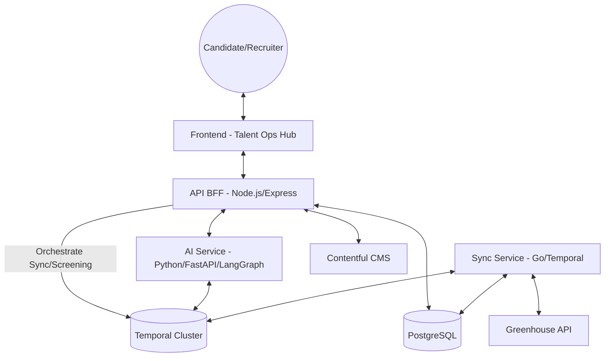

# Candy AI Platform Architecture

## Overview
Candy AI is a modular, AI-first recruitment platform designed for scalability, reliability, and high-performance synchronization. The system follows a microservices architecture with clearly defined boundaries for business logic, infrastructure, and AI orchestration.

## System Map

## Service Responsibilities

### 1. API (Node.js/Express)
- **Primary Role**: The Backend-for-Frontend (BFF).
- **Responsibilities**:
  - Managing **Candidates** and **Application** lifecycles.
  - Exposing REST endpoints for Career Site and Talent Ops Hub.
  - Validating recruiter actions and candidate submissions via Zod.
  - Orchestrating multi-service workflows via Temporal.

### 2. Sync Service (Golang)
- **Primary Role**: Data Ingestion & Integration.
- **Responsibilities**:
  - Synchronizing the system with external ATS (Greenhouse).
  - Normalizing external job data into the internal recruitment schema.
  - Managing high-throughput transactional updates to jobs inventory.

### 3. AI Service (Python/FastAPI)
- **Primary Role**: Intelligent Screening & Evaluation.
- **Responsibilities**:
  - **Candidate Assessment**: Using LangGraph to screen applicants against job requirements.
  - Generative Chat: Real-time candidate assistance and guidance.
  - Providing suitability scores to the Recruiter dashboard.

### 4. Frontend (React)
- **Primary Role**: Recruitment Interface.
- **Responsibilities**:
  - **Career Site**: Public job discovery and application entry.
  - **Talent Ops Hub**: Recruiter dashboard for pipeline management and integration health monitoring.
  - Providing a cohesive, modern UI for both candidates and the hiring team.

## Data Strategy
- **Persistence**: Shared PostgreSQL instance for jobs, sync history, and persistence.
- **State Management**: Temporal orchestrates long-running and failure-prone tasks (like syncs and AI analysis).
- **Consistency**: Unique indexing on job IDs from external sources prevents duplication during concurrent syncs.

## Deployment & Production Readiness
- **Orchestration**: Docker Compose for local dev; Kubernetes-ready Dockerfiles.
- **Monitoring**: Standardized logging (Winston in JS, Slog in Go, Python standard logging).
- **Lifecycle**: SIGTERM/SIGINT handled across all services for graceful shutdown and pool drainage.
- **Security**: Environment variable strategy for secrets; strict input validation middleware.
