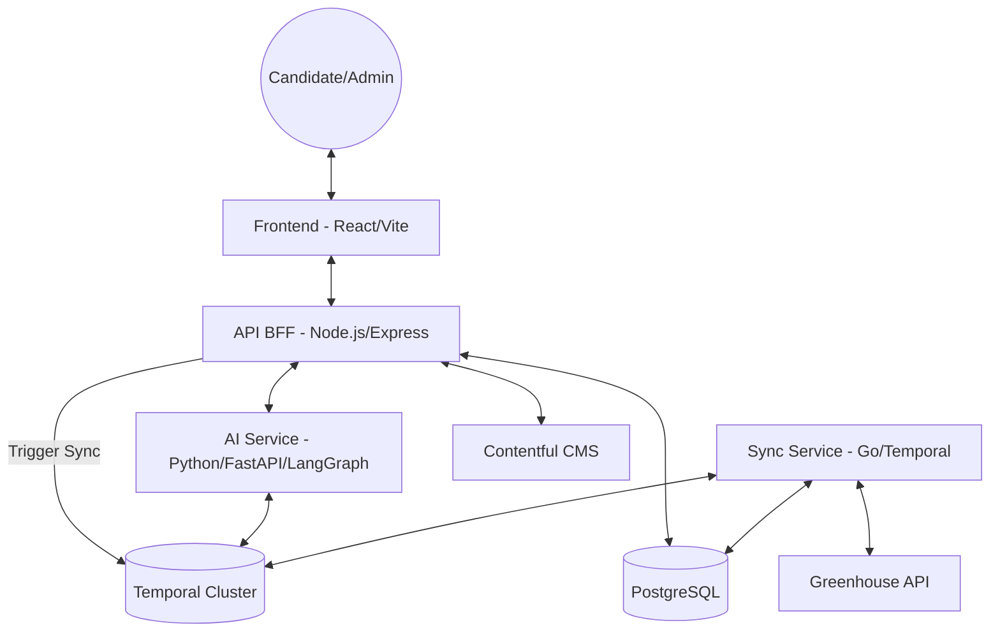

# Candy AI Platform Architecture

## Overview
Candy AI is a modular, AI-first recruitment platform designed for scalability, reliability, and high-performance synchronization. The system follows a microservices architecture with clearly defined boundaries for business logic, infrastructure, and AI orchestration.

## System Map

## Service Responsibilities

### 1. API (Node.js/Express)
- **Primary Role**: The Backend-for-Frontend (BFF).
- **Responsibilities**:
  - Exposing REST endpoints for the frontend (Jobs, Filters, Admin).
  - Validating user inputs via Zod.
  - Aggregating data from PostgreSQL and Contentful CMS.
  - Triggering Temporal workflows for Greenhouse synchronization.
  - Providing health and readiness probes for orchestration.

### 2. Sync Service (Golang)
- **Primary Role**: High-performance data ingestion.
- **Responsibilities**:
  - Running a Temporal Worker for durable job synchronization.
  - Fetching job listings from the Greenhouse API.
  - Persisting data safely in PostgreSQL using transactional upserts.
  - Marking stale listings as inactive to maintain inventory accuracy.

### 3. AI Service (Python/FastAPI)
- **Primary Role**: Intelligent candidate interaction.
- **Responsibilities**:
  - Hosting the recruiting chatbot via LangGraph state machines.
  - Natural Language Understanding (NLU) for candidate queries.
  - Decision logic for human escalation (via Temporal + LLM).
  - Integration with OpenAI/LangChain.

### 4. Frontend (React)
- **Primary Role**: User Interface.
- **Responsibilities**:
  - Presentation of job openings and filters.
  - Integrated AI assistant interface.
  - Admin dashboard for sync monitoring and manual triggering.
  - Theming, dark mode, and glassmorphic aesthetics.

## Data Strategy
- **Persistence**: Shared PostgreSQL instance for jobs, sync history, and persistence.
- **State Management**: Temporal orchestrates long-running and failure-prone tasks (like syncs and AI analysis).
- **Consistency**: Unique indexing on job IDs from external sources prevents duplication during concurrent syncs.

## Deployment & Production Readiness
- **Orchestration**: Docker Compose for local dev; Kubernetes-ready Dockerfiles.
- **Monitoring**: Standardized logging (Winston in JS, Slog in Go, Python standard logging).
- **Lifecycle**: SIGTERM/SIGINT handled across all services for graceful shutdown and pool drainage.
- **Security**: Environment variable strategy for secrets; strict input validation middleware.
